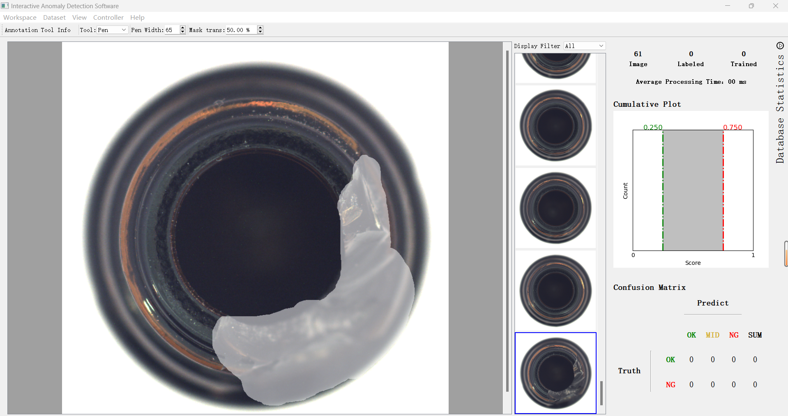
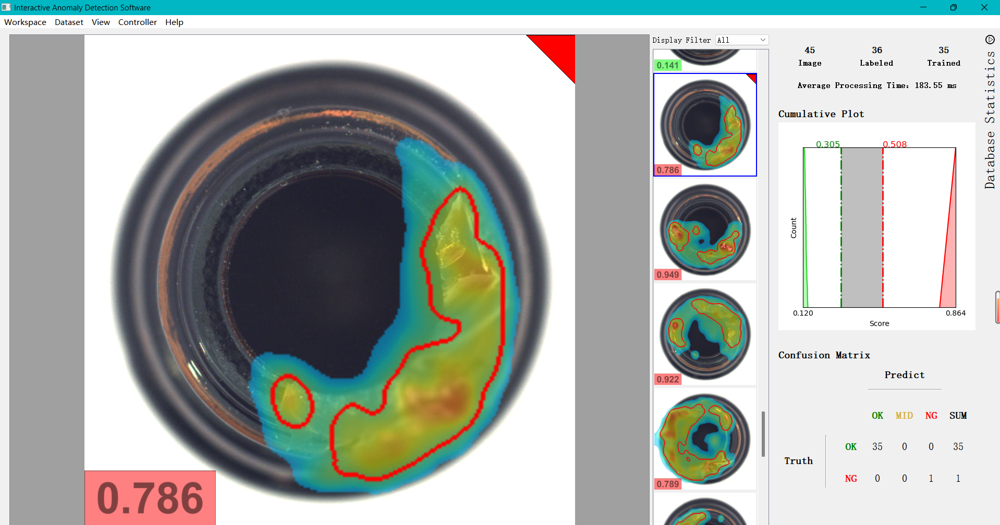
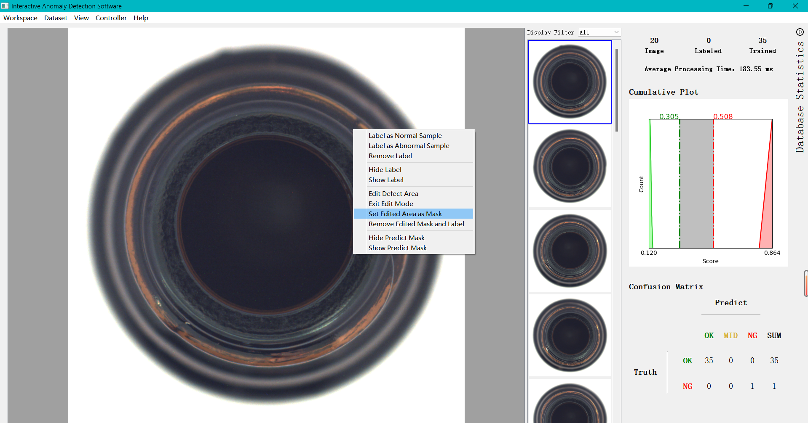

# Interactive Anomaly Detection

A software that allows you to manually label a few abnormal images(realized), enabling the model to learn and accurately detect similar anomalies in the future(to be realized).

## Setup

- python >= 3.9.18
- PyQt5 >= 5.15.11
- numpy >=1.21.5
- torch >= 2.4.1
- opencv == 4.6.0
- sip == 6.7.12
- scikit-image == 0.20.0
- matplotlib == 3.5.1

## Usage
python main.py

Press the datasets button->Load Images->label select image->Press the datasets button->Train(Built-in algorithms noly use normal image)->process

If you want to label image, right-click the mouse, and select Edit Defect Area

## Manual anomaly labeling

## Statistical image information(You can move the red and green lines in Cumulative Plot to adjust the selected area.)

## Function Selection

## Apology
Using some unimplemented functions may cause the program to terminate unexpectedly.

The model was not trained using multi-threading, so you have to wait for the training to finish.

Our interaction algorithm has not been fully implemented (it will be updated once implemented).

## Feel free to contribute by fixing bugs or adding new functions!
